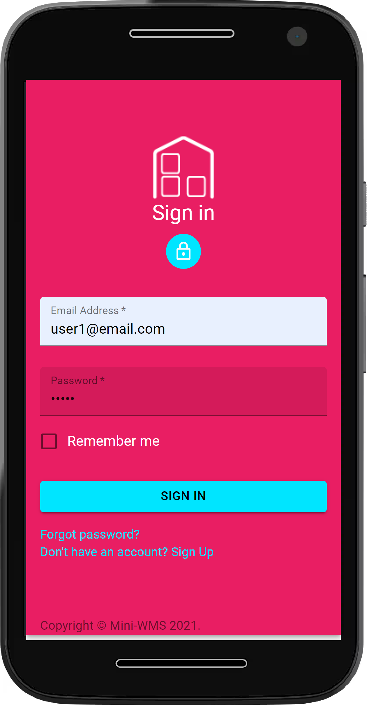
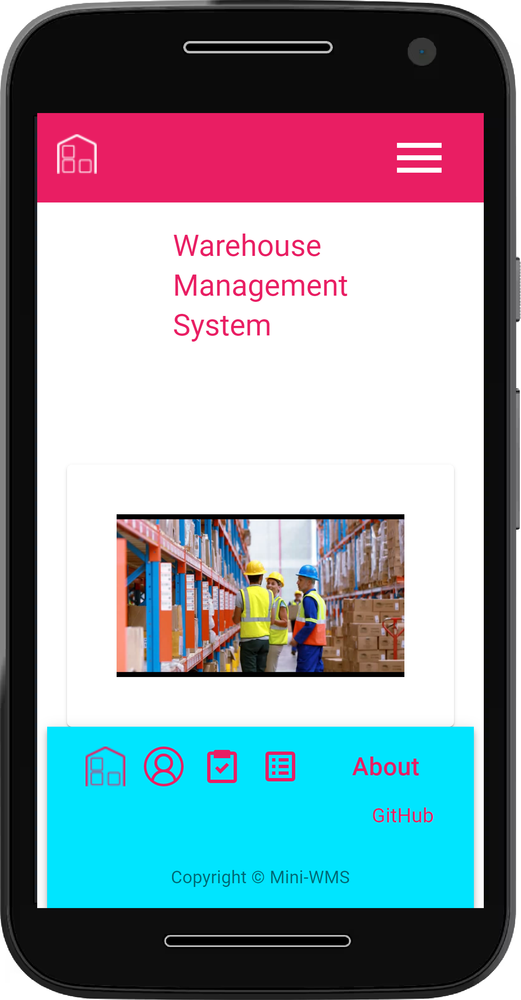
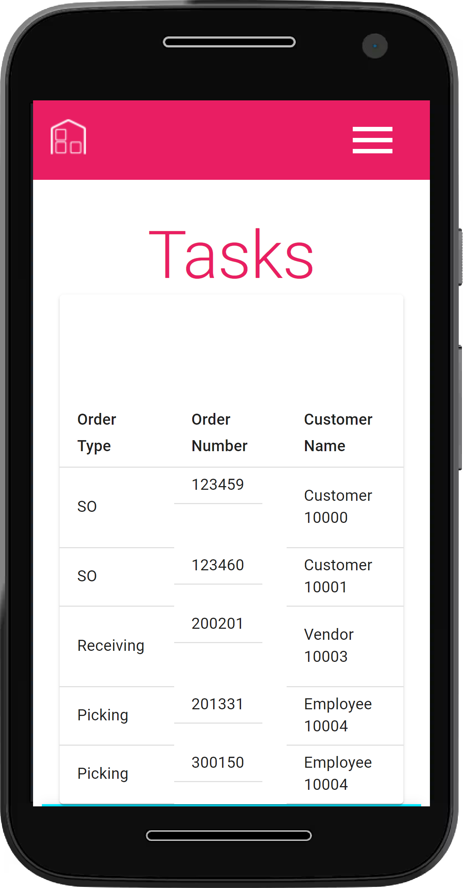
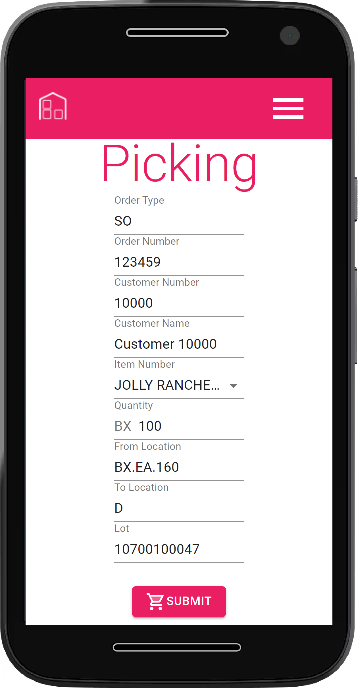
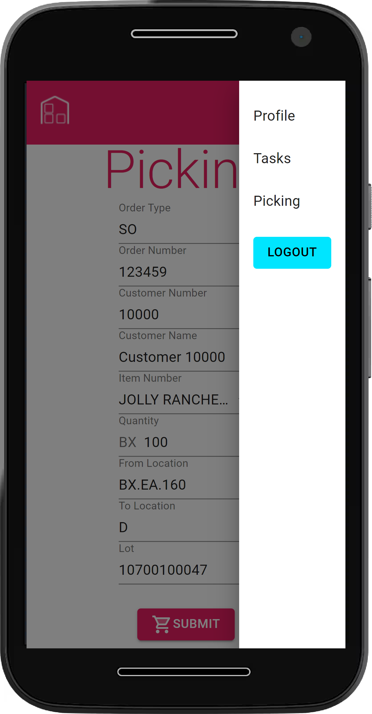
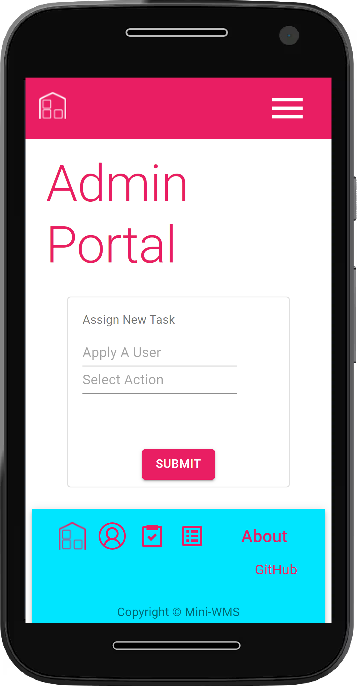

# RTCJ Project #3

[](https://opensource.org/licenses/MIT)

## Description

This is a Warehouse Management System (WMS) application that can assign tasks to users to pick from warehouse inventory. The application keeps track of inventory by item, location, and lot, and keeps a separate record of inventory transactions in a cardex. The application is meant to run in tandem with an ERP system from which orders, items, customers, users, and other parameters are pulled. The application has data structures to support future additional features like receiving and replenishment.

## Table of Contents

- [Deployed Application](#deployed-application)
- [User Story](#user-story)
- [Mock-Up](#mock-up)
- [Tech-Used](#tech-used)
- [License](#license)
- [Contribute](#contribute)

## Deployed Application

The live application can be found at this link:

https://ku-cbc-wms.herokuapp.com/

Although a sign up form has been provided for development purposes, in a production environment, users will be created through an admininistration page from which they will be assigned a profile, including the types of operations that they can perform in the WMS system.

## User Story

```md
AS A Warehouse Inventory Manager
I WANT to be able to pick inventory from locations in my warehouse for dispatch purposes
SO THAT I can keep track of my inventory, fullfill my sales orders, and make better use of the available pickers and inventory lots in the warehouse
```

## Mock-Up

The following images portray the look and feel of the deployed application in Heroku.

### Login Page



### Main Page



### Tasks Page



### Picking Page



### Administration Page




## Tech-Used

This project was completed using the following technologies:

### Front End Development:

- React
- Material UI
- PWA - Service Worker

### Back End Development:

- GraphQL
- Apollo
- JWT
- Node.js
- Express.js
- MongoDB
- Mongoose

## License

Licensed under the [MIT](https://choosealicense.com/licenses/mit/)

    MIT License

    Copyright (c) [2021] [RTCJ]

    Permission is hereby granted, free of charge, to any person obtaining a copy
    of this software and associated documentation files (the "Software"), to deal
    in the Software without restriction, including without limitation the rights
    to use, copy, modify, merge, publish, distribute, sublicense, and/or sell
    copies of the Software, and to permit persons to whom the Software is
    furnished to do so, subject to the following conditions:

    The above copyright notice and this permission notice shall be included in all
    copies or substantial portions of the Software.

    THE SOFTWARE IS PROVIDED "AS IS", WITHOUT WARRANTY OF ANY KIND, EXPRESS OR
    IMPLIED, INCLUDING BUT NOT LIMITED TO THE WARRANTIES OF MERCHANTABILITY,
    FITNESS FOR A PARTICULAR PURPOSE AND NONINFRINGEMENT. IN NO EVENT SHALL THE
    AUTHORS OR COPYRIGHT HOLDERS BE LIABLE FOR ANY CLAIM, DAMAGES OR OTHER
    LIABILITY, WHETHER IN AN ACTION OF CONTRACT, TORT OR OTHERWISE, ARISING FROM,
    OUT OF OR IN CONNECTION WITH THE SOFTWARE OR THE USE OR OTHER DEALINGS IN THE
    SOFTWARE.

## Collaborators

Project 3: Mini-WMS

Travis Brown @ https://github.com/bergannation

Rigo A Pinell @ https://github.com/japinell

Connor Gannaway @ https://github.com/gannacon

Joel Stockard @ https://github.com/jtstockard

## Questions

If you have any questions regarding this application please contact the team on GitHub here: (https://github.com/japinell/KU-CBC-Project-3-WMS)

---

© 2021 RTCJ. All Rights Reserved.
