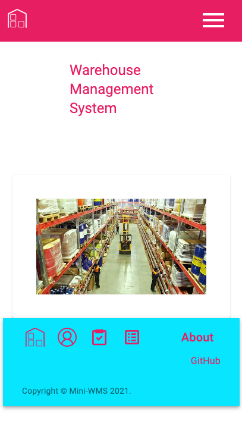

# RTCJ Project #3

[](https://opensource.org/licenses/MIT)

## Description

This is a warehouse management system application that can assign tasks to users to pick from warehouse inventory.

## Table of Contents

- [Deployment](#deployment)
- [User Story](#user-story)
- [Mock-Up](#mock-up)
- [License](#license)
- [Contribute](#contribute)

## Deployment

The app can be found at this link:

## User Story

```md
AS A Warehouse Inventory Manager
I WANT to be able to pick from and update my inventory.
SO THAT I can keep track of my warehouse inventory
```

## Mock-Up

The following image shows a screenshot of the deployed application.



## License

Licensed under the [MIT](https://choosealicense.com/licenses/mit/)

    MIT License

    Copyright (c) [2021] [RTCJ]

    Permission is hereby granted, free of charge, to any person obtaining a copy
    of this software and associated documentation files (the "Software"), to deal
    in the Software without restriction, including without limitation the rights
    to use, copy, modify, merge, publish, distribute, sublicense, and/or sell
    copies of the Software, and to permit persons to whom the Software is
    furnished to do so, subject to the following conditions:

    The above copyright notice and this permission notice shall be included in all
    copies or substantial portions of the Software.

    THE SOFTWARE IS PROVIDED "AS IS", WITHOUT WARRANTY OF ANY KIND, EXPRESS OR
    IMPLIED, INCLUDING BUT NOT LIMITED TO THE WARRANTIES OF MERCHANTABILITY,
    FITNESS FOR A PARTICULAR PURPOSE AND NONINFRINGEMENT. IN NO EVENT SHALL THE
    AUTHORS OR COPYRIGHT HOLDERS BE LIABLE FOR ANY CLAIM, DAMAGES OR OTHER
    LIABILITY, WHETHER IN AN ACTION OF CONTRACT, TORT OR OTHERWISE, ARISING FROM,
    OUT OF OR IN CONNECTION WITH THE SOFTWARE OR THE USE OR OTHER DEALINGS IN THE
    SOFTWARE.

## Contribute

[](code_of_conduct.md)

Please give me credit! This is not an original idea but an original way to create this.

## Questions

If you have any questions regarding this application please contact the team on GitHub here: (https://github.com/japinell/KU-CBC-Project-3-WMS)

---

© 2021 RTCJ. All Rights Reserved.
